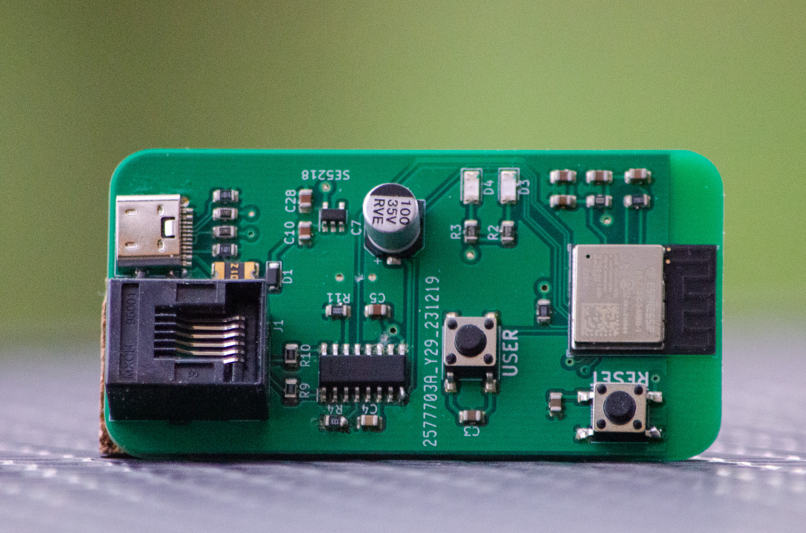

# Documentation of Layblar PCB

This is the documentation of the custom PCB of Layblar Hardware done by KiCad. 

# Layblar PCB

Layblar has its own PCB for handling all the read routines of the smart meter. The PCB is connected to the VKW smart meter via an RJ-12 cable. The ESP32-C3 chip retrieves both frames from the M-Bus Transceiver NCN5150 every 5 seconds. The microcontroller processes these two frames, decrypts the messages, and parses each value into structs for easier handling in the code. A JSON string is built with all available values sent from the smart meter, and a timestamp from the smart meter is added to the JSON string. The JSON string is then sent to the broker via MQTT-S. It uses the serial number of the smart meter as the MQTT topic. The microcontroller has buffer to store the JSON strings in case of short network issues.

## Troubles

The assembled PCB encountered issues, as the microcontroller could not receive correct messages from the M-Bus Transceiver. Upon inspecting the communication via an oscilloscope, only fragments of the expected frame were transmitted. This issue could be attributed to a voltage drop. After disconnecting pin VDD of the M-Bus Transceiver from the 3.3V power supply, the communication worked perfectly. The M-Bus Transceiver is now solely powered by the M-Bus communication from the smart meter, without relying on the 5V-to-3V3 converter powered by USB.

# Changelog

## Contributors

- [André Maurer](https://github.com/bouncecom)

## 2024-01-24

- Added docs
- Updated bugfix also in KiCad

## 2024-01-18

- Fixed not working PCB

## 2024-01-13

- Checked PCB functions

## 2023-11-26

- Created first version of PCB used KiCad.
- Created new repository for PCB.
- Created doc files for PCB.
